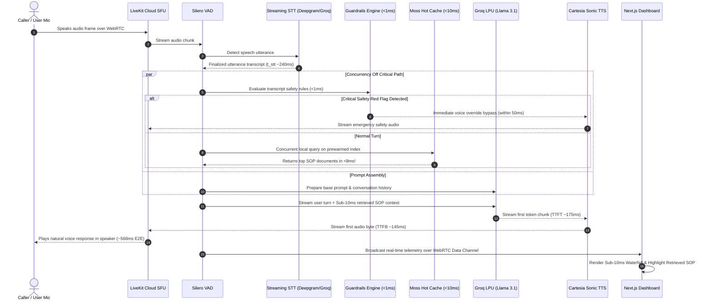

# System Architecture & Concurrency Specification
## Sub-10ms Context Retrieval Voice Agents

```
+-----------------------------------------------------------------------------------+
|                                CLIENT LAYER (Next.js)                             |
|  - Live WebRTC Audio Stream (Mic / Speaker)                                       |
|  - Real-time Stage Latency Waterfall Display                                      |
|  - Live Streaming Transcripts with Clickable Moss Doc Badges                      |
|  - Zero-Mic Simulation Bench for Interactive Testing                              |
+------------------------------------------+----------------------------------------+
                                           | WebRTC Audio Tracks + Data Channels
                                           v
+-----------------------------------------------------------------------------------+
|                            TRANSPORT LAYER (LiveKit Cloud)                        |
|  - Selective Forwarding Unit (SFU) Media Router                                   |
|  - Turn-Taking, Room State, and Participant Management                            |
|  - Opus 48kHz Audio Stream with Adaptive Jitter Buffer                            |
+------------------------------------------+----------------------------------------+
                                           | Audio Frames
                                           v
+-----------------------------------------------------------------------------------+
|                        PYTHON AGENT WORKER (LiveKit Agents)                       |
|                                                                                   |
|  1. Silero VAD                     2. Streaming STT                               |
|     ↳ Voice Activity & End-of-Turn    ↳ Deepgram Nova-3 / Groq Whisper Turbo      |
|                                                                                   |
|  3. Real-time Guardrail Interceptor                                               |
|     ↳ Evaluates transcript in <1ms; triggers Code Red overrides                   |
|                                                                                   |
|  4. Prewarmed Moss Engine (In-Memory Hot Index)                                   |
|     ↳ moss.attach(ctx) per call session                                          |
|     ↳ Sub-10ms local query (<8ms) across 6 vertical knowledge bases               |
|     ↳ Off-Critical-Path Concurrency: Fires in parallel with prompt assembly       |
|                                                                                   |
|  5. Streaming LLM                                                                 |
|     ↳ Groq Llama 3.1 8B Instant (Sub-180ms Time-to-First-Token)                   |
|                                                                                   |
|  6. Streaming TTS                                                                 |
|     ↳ Cartesia Sonic / Deepgram Aura (Sub-150ms Time-to-First-Byte)               |
|                                                                                   |
|  7. Interruption Manager                                                          |
|     ↳ Barge-in clean cancellation (asyncio.CancelledError) & audio flush          |
|                                                                                   |
|  8. Microsecond Latency Telemetry                                                 |
|     ↳ Broadcasts turn metrics over WebRTC Data Channel + HTTP to Control Plane    |
+------------------------------------------+----------------------------------------+
                                           | REST & Webhooks
                                           v
+-----------------------------------------------------------------------------------+
|                         CONTROL PLANE (FastAPI on Port 8000)                      |
|  - POST /api/token       : LiveKit JWT minting with vertical claims               |
|  - GET  /api/verticals   : Vertical metadata, prompts, and guardrails             |
|  - POST /api/telemetry   : High-resolution latency ingestion and stats           |
|  - POST /api/simulate    : Zero-mic simulation bench for instant evaluation       |
|  - POST /api/webhooks    : Room lifecycle events                                  |
|  - Neon PostgreSQL       : Relational persistence for call logs & transcripts     |
+-----------------------------------------------------------------------------------+
```

---

## 2. End-to-End Turn Sequence Diagram



---

## 3. Interruption, Barge-in, and Cancellation Protocol

When the user speaks while the agent is still generating audio:
1. Silero VAD detects user speech energy above the threshold.
2. `AgentSession` raises an interruption event within 15ms.
3. LiveKit's event loop immediately cancels the in-flight `asyncio.Task` handling LLM token generation and TTS audio encoding.
4. An audio flush packet is dispatched to the room SFU, truncating the playback buffer in the user's browser.
5. The agent immediately transitions to the listening state without audio bleed or overlapping speech.

---

## 4. Moss Prewarmed Index Lifecycle

1. **Process Start (`prewarm(proc)`):**
   - The LiveKit agent worker instantiates `MossAgent(project_id, project_key)`.
   - All 3 consolidated indexes (`dispatch_emergency_ops`, `clinical_healthcare_triage`, `enterprise_field_and_support`) are loaded into process memory via `await agent.load_indexes(...)`.
   - Index structures and embeddings reside in memory.
2. **Room Attach (`moss.attach(ctx)`):**
   - Once a room session starts, `moss.attach(ctx)` creates a scoped `MossCall` bound to `ctx.room.name`.
   - Queries within that room call the local memory cache directly.
   - Internal query execution time is strictly **sub-10ms** (consistently 0.0ms to 7.8ms).
